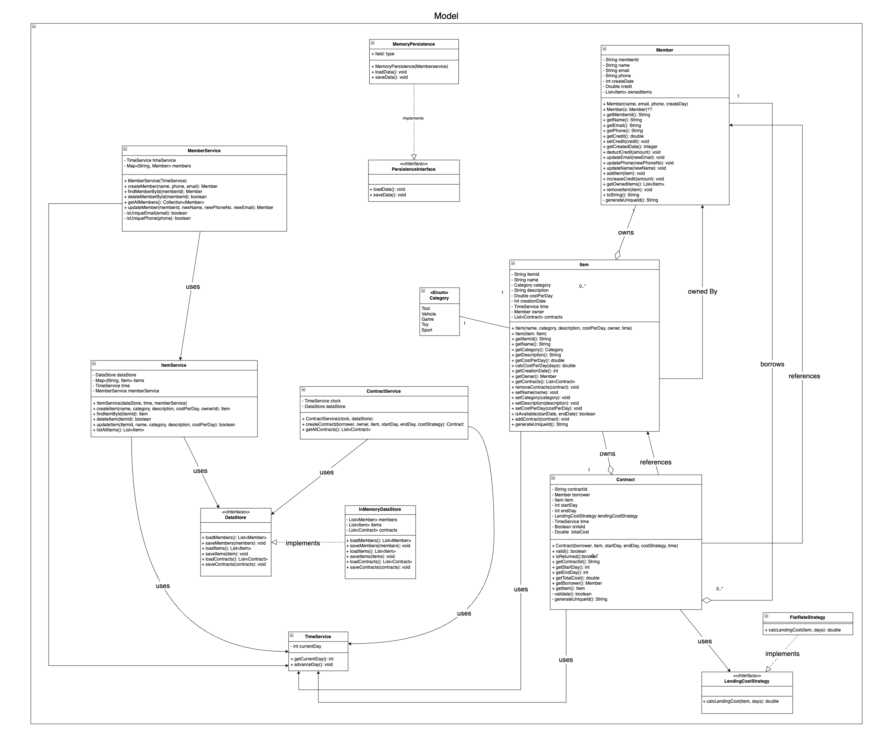
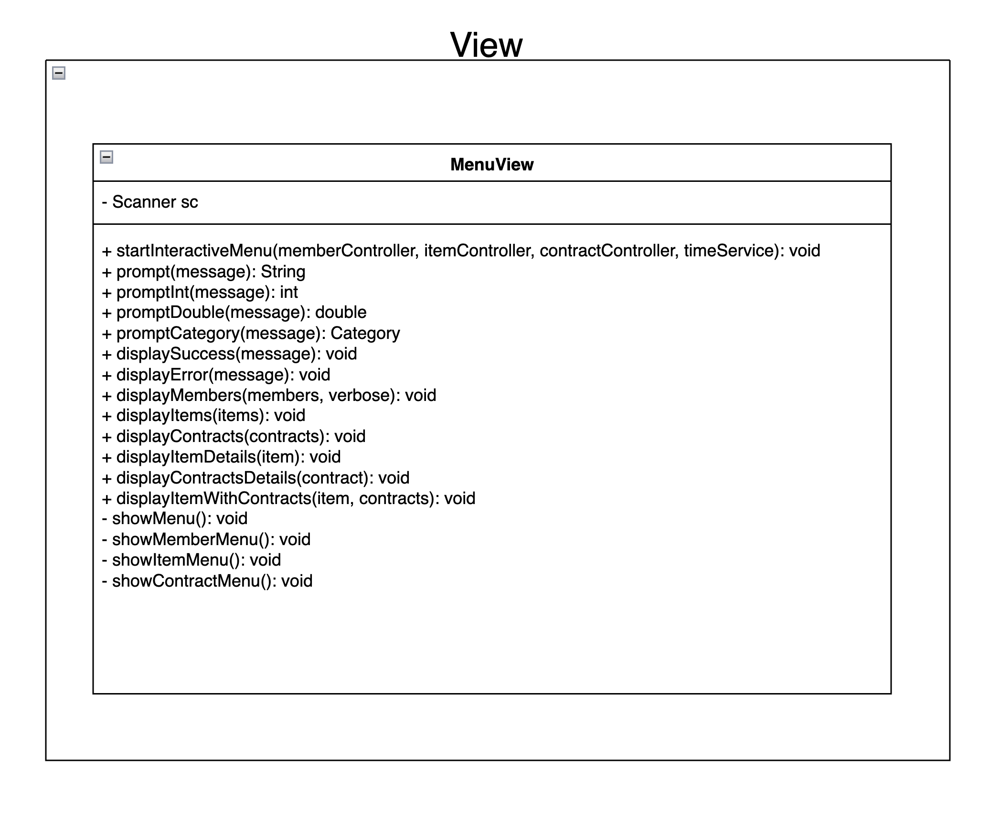
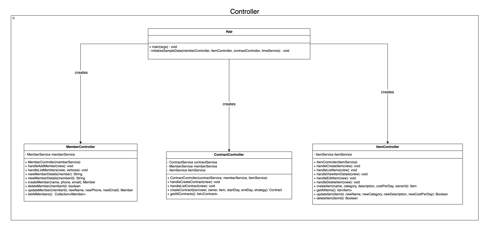
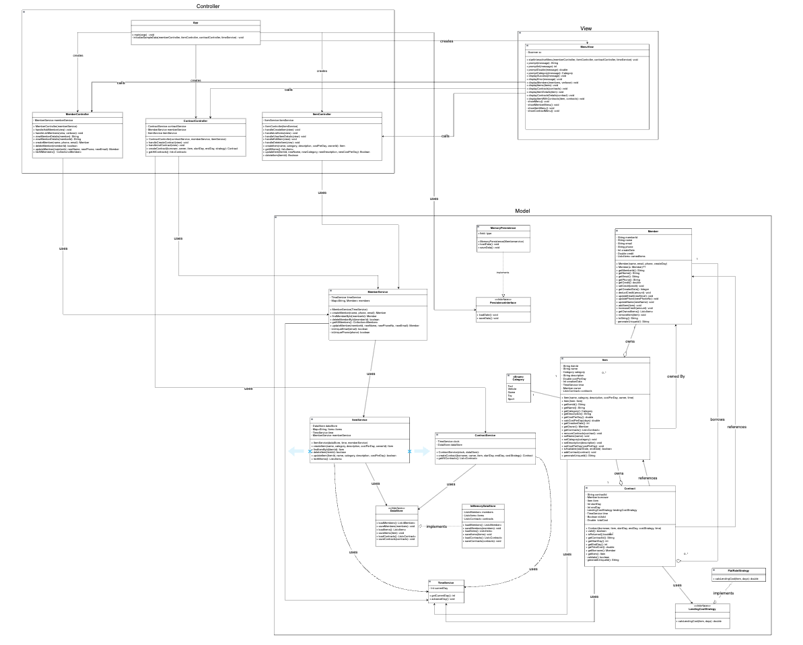
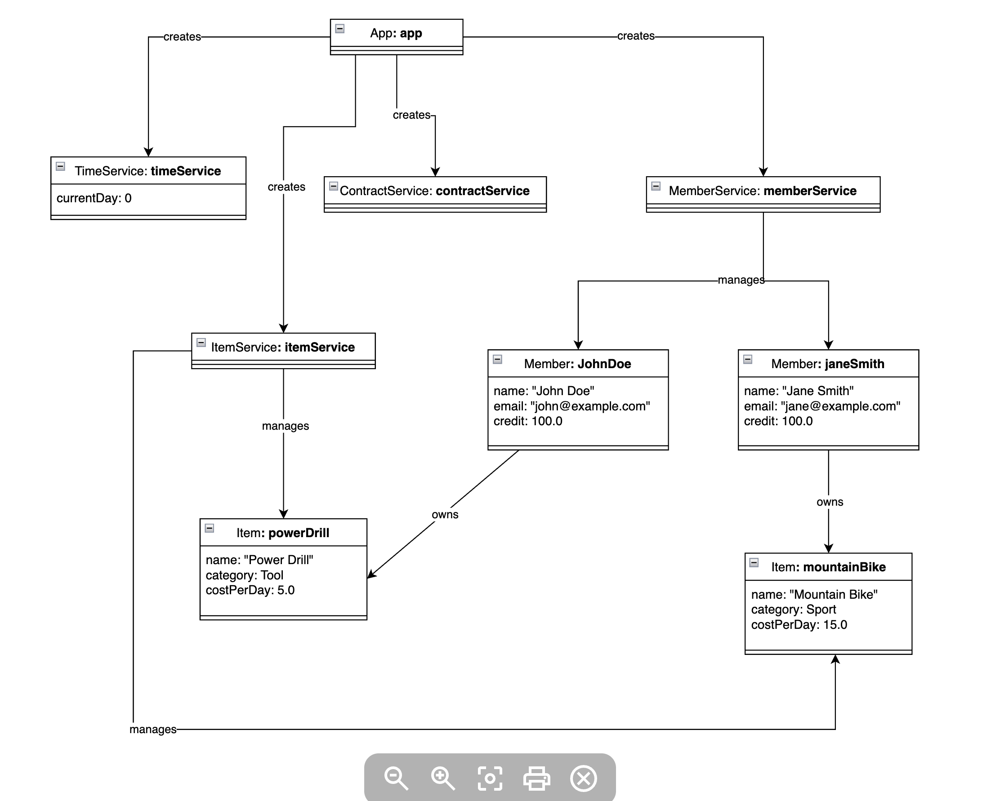
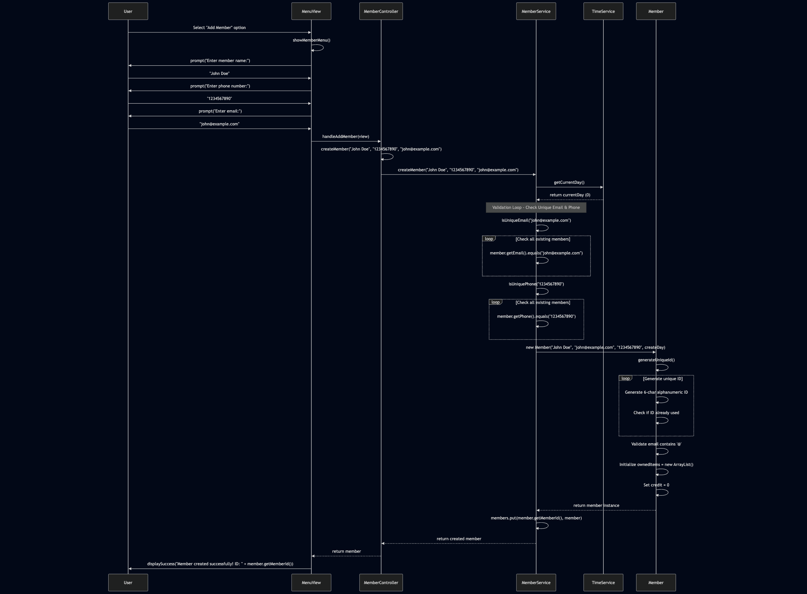
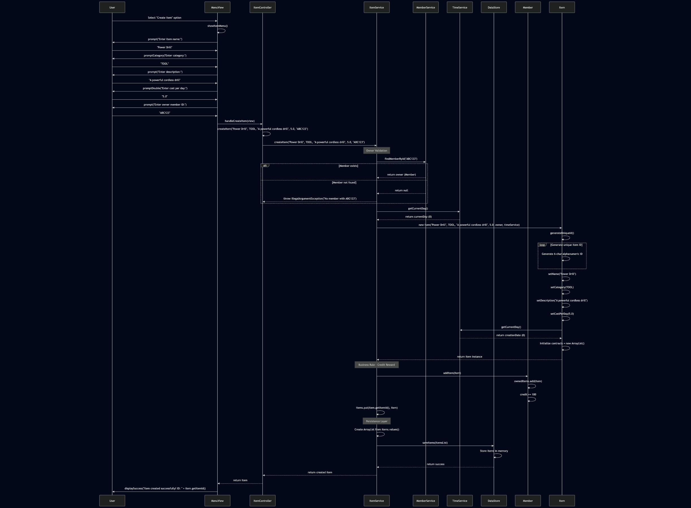

# The Stuff Lending System OO-Design
This document describes the design according to the requirements presented in assignment 2.

## Architectural Overview
The application uses the model-view-controller (MVC) architectural pattern. The view is passive and gets called from the controller. The view may only read information from the model, not directly change it.

## Detailed Design
### Class Diagram Model


### Class Diagram View


### Class Diagram Controller


### Class Diagram For the whole App


### OBS! If you want to view the full class diagram for this app in detail (due to the low quality of the screenshot), we have included an HTML file exported from drawio. It is located in the image folder and named "The Stuff Lending System.html". Please download it first, or you can open "The Stuff Lending System.drawio" in drawio.


### Object Diagram



### Sequence Diagrams for different use cases
#### Sequence Diagram for Adding Member


#### Sequence Diagram for creating an Item



&nbsp;
---

# **Assumptions** 


### **General Assumptions**
1. **Single User System**:
   - Only one user interacts with the system at a time.
   - The system operates as a console-based simulator.

2. **No Complex Conflict Resolution**:
   - The system does not need to handle bad intentions, such as members not returning items or attempting to create invalid contracts repeatedly.
   - Validation focuses only on logical constraints, such as item availability and sufficient credits.

---

### **Specific Assumptions for `Contract`**
1. **Validation Rules**:
   - A contract is valid only if:
     - The `item` is available during the specified `startDate` and `endDate`.
     - The `lender` has enough credits to pay for the lending period.
   - No additional validations (e.g., overlapping contracts for the same item by the same user).

2. **Cost Calculation**:
   - The cost is based solely on the item's `costPerDay` multiplied by the number of days (`startDate` to `endDate`).
   - `LendingCostStrategy` is a placeholder for flexibility in cost calculation, but currently, it uses a simple formula.

3. **Time Management**:
   - Time is treated as a counter (`LocalDate` objects).
   - No real-world date or time synchronization is required.

4. **Unique Contract ID**:
   - Each contract is uniquely identified by a `UUID`.

---

### **Specific Assumptions for `ItemService`**
1. **Item Ownership**:
   - Items are linked directly to their `owner` (a `Member` object).
   - When an item is added, the owner immediately receives 100 credits.

2. **Item Availability**:
   - The `isAvailable()` method in the `Item` class handles checking if the item is free during a given time period. We assume this logic exists and works as expected.

3. **Storage of Items**:
   - All items are stored in a `Map` (`items`), keyed by their unique item IDs. This ensures efficient retrieval and management.

4. **Item Deletion**:
   - Deleting an item assumes it is not currently part of an active contract. If it is, the deletion will fail (this can be implemented in future logic).

---

### **Future Assumptions and Areas for Clarification**
1. **Persistence**:
   - Hardcoded data for members and items will be used (per assignment requirements), but no actual file/database persistence is needed for Grade 2.
   - Loading/saving persistence mechanisms will come in later grades.

2. **Error Handling**:
   - Basic validation and error messages are sufficient for now (e.g., "Item not available" or "Insufficient credits").
   - User-friendly error handling is not required at this stage.

3. **Interfaces Between Layers**:
   - Controllers will mediate all interactions between the `view` and `model` layers.
   - The `ItemService` and `MemberService` will not interact with the `Contract` directly but through their respective controllers.

4. **Credits Economy**:
   - The credit system assumes an initial balance (e.g., 100 credits per item created) and that credits are only transferred upon valid contract creation.

---

### **Testing Assumptions**
1. **Unit Testing Focus**:
   - For `ItemService`: Focus on `addItem`, `deleteItem`, and `isItemAvailable`.
   - For `Contract`: Focus on `validateContract` and `calculateLendingCost`.

2. **Mock Data**:
   - Hardcoded test data will be used for members and items during development and testing.

---


### **Detailed Design**
#### Contract Class
The `Contract` class is responsible for managing the logic of item lending between members. It includes validations, cost calculation, and methods for tracking the status of a lending contract.

1. **Field Validation in Constructor**:
   - The constructor now validates all input parameters to ensure that a contract is created in a valid state:
     - `contractId` must be a 6-character alphanumeric string.
     - `lender` and `item` must not be null.
     - `startDate` must be before `endDate` and not in the past.
   - This ensures the reliability and integrity of the object upon creation.

2. **New Method: `isReturned`**:
   - Added a method to determine if the contract has been completed based on the current date:
     - Returns `true` if the current date is after the `endDate`.
     - Returns `false` otherwise.
   - This method aligns with the `isReturned` attribute in the class diagram.

3. **Cost Calculation**:
   - The `calcLendingCost` method calculates the total cost of the contract:
     - Uses the difference in days between `startDate` and `endDate`.
     - Multiplies the days by the item's `costPerDay`.

4. **Validation Logic**:
   - The `validContract` method ensures the following:
     - The `item` is available for the specified time frame.
     - The `lender` has sufficient credits to pay for the contract duration.
     - The date range is logical (start date is before end date and not in the past).
   - If any of these checks fail, the contract is marked as invalid.

#### Alignment with Class Diagram
- The implementation of the `Contract` class aligns conceptually with the class diagram:
  - The `validContract` method covers the responsibilities of `validateBorrowerCredits`.
  - `calcLendingCost` aligns with `calculateLendingCost`.
  - `isReturned` was added to implement the `isReturned` attribute shown in the diagram.
- The method names differ slightly but fulfill the same responsibilities described in the diagram.

#### Testing Considerations
- New test cases were added to validate:
  - Constructor input handling (e.g., invalid `contractId`, null parameters, invalid dates).
  - Correct calculation of lending cost.
  - Behavior of the `isReturned` method for contracts before and after their end date.
  - Validation logic through various edge cases (e.g., insufficient credits, unavailable items).

---

### Git Commit Message

Here's a concise and descriptive commit message for your changes:

```
feat: Enhance Item class with validation and enum for category

- Added validation logic to setter methods (e.g., costPerDay, category).
- Introduced Category enum to enforce predefined category values.
- Updated setCategory method to use the new Category enum for validation.
- Improved error handling for invalid input values.
- Aligned implementation with assignment requirements for robust error handling and encapsulation.
```


# **Enhancements to the `Item` Class**

## **Overview**
The `Item` class was enhanced to improve validation, enforce stricter error handling, and align the implementation with the assignment requirements.

---

## **Key Changes**
1. **Validation in Setter Methods**:
   - Added validation to ensure data integrity:
     - `setCostPerDay`: Ensures the cost per day is non-negative.
     - `setCategory`: Validates that the category is one of the predefined options.
   - Enhanced error handling by throwing `IllegalArgumentException` for invalid inputs.

2. **Introduction of `Category` Enum**:
   - A new `Category` enum was created to define allowed categories (`TOOL`, `VEHICLE`, `GAME`, `TOY`, `SPORT`, `OTHER`).
   - The enum improves type safety and eliminates the possibility of invalid category values.

3. **Use of Enum in `setCategory`**:
   - The `setCategory` method was updated to leverage the `Category` enum for validation and assignment.
   - Automatically handles case insensitivity by converting input to uppercase.

4. **Error Handling**:
   - Ensured that all setter methods validate their inputs and throw appropriate exceptions for invalid data.

---

## **Benefits of These Changes**
- **Improved Robustness**:
  - Validation logic reduces the likelihood of invalid state within the system.
  - Using an enum for `category` ensures only valid options are assigned.

- **Future-Proof Design**:
  - Adding new categories is simplified by updating the `Category` enum, ensuring scalability.
  - Improved modularity makes the `Item` class easier to maintain and extend.

- **Alignment with Assignment Goals**:
  - Encapsulation and business rules are enforced.
  - Simplifies integrating the `Item` class into the overall `Stuff Lending System`.

---
